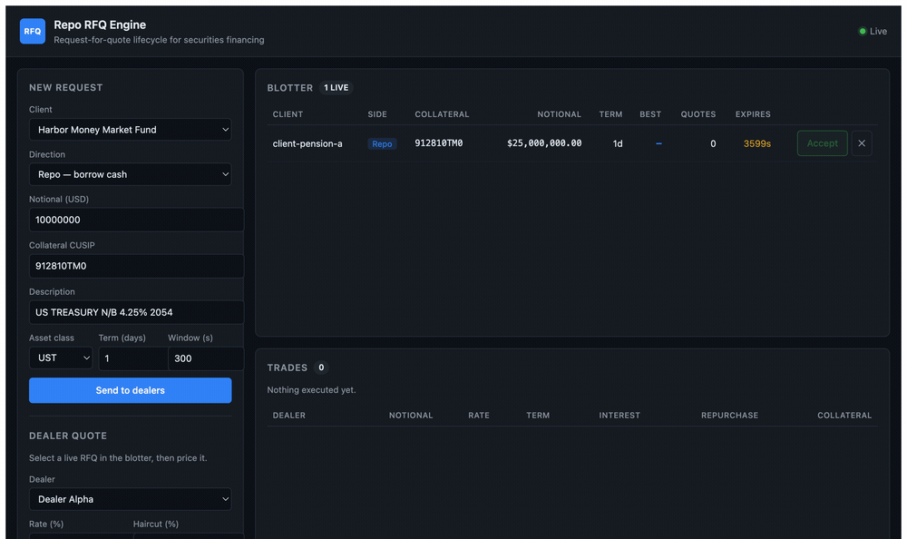
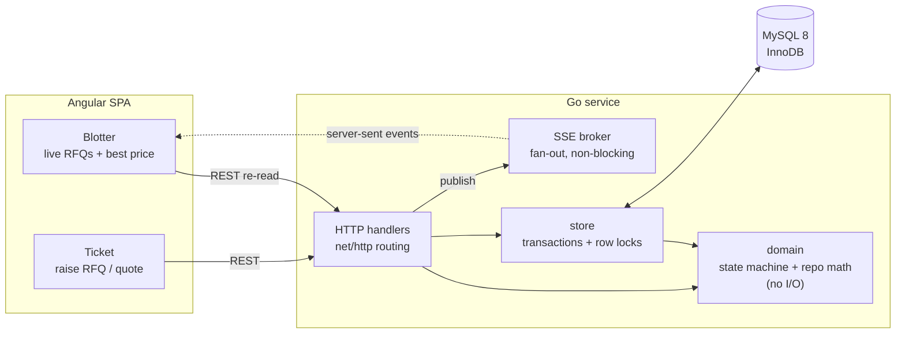
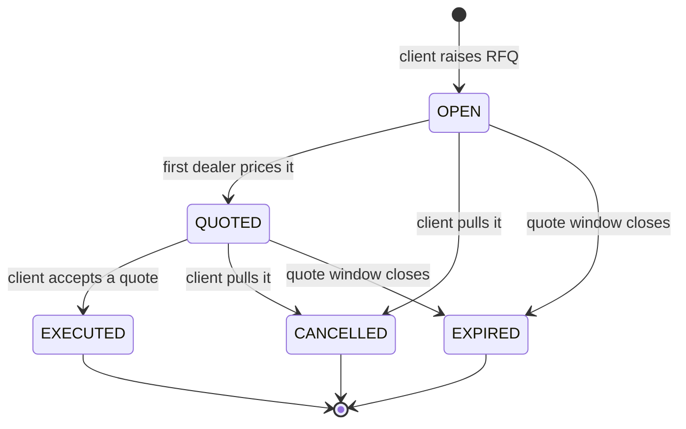
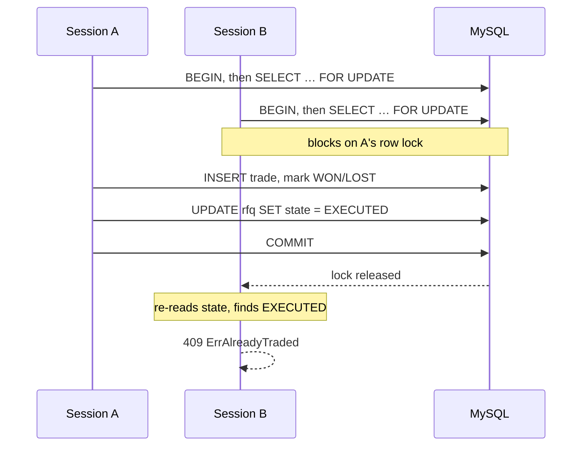

# repo-rfq-engine

A request-for-quote lifecycle service for **repo** (securities financing), built
in Go + MySQL with an Angular trading blotter.

A buy-side firm raises an RFQ against collateral. Dealers compete on price. The
client accepts the best quote and a trade books with its cash legs computed. That
one workflow — the core of every electronic securities-financing platform — is
implemented end to end and tested properly, rather than sketched broadly.

> Built as a learning project to work through the mechanics of repo trading and
> the concurrency problems an RFQ platform has to solve. It is a simulator: no
> real counterparties, no market data feed, no settlement.



Above: a $25m overnight Treasury repo and a $50m 7-day agency reverse repo go
out to dealers, quotes land live over the event stream, the quote ladder shows
the winning price, and accepting books the trade with its interest, repurchase
price, and collateral requirement. Note the two rows rank oppositely — the repo
takes the *lowest* rate, the reverse repo the *highest*.

---

## The problem this solves

In a repo, one party sells securities and agrees to buy them back later at a
higher price. Economically it is a **secured cash loan**: the seller borrows
cash, the securities are collateral, and the price difference is the interest.

Three things make this harder to model than it looks:

**Direction inverts what "best" means.** A repo client *borrows* cash and pays
the rate, so they want the **lowest** quote. A reverse-repo client *lends* cash
and earns it, so they want the **highest**. One boolean flips the comparison —
get it backwards and the system confidently trades at the worst price in the book
while reporting it as the best.

**Money cannot be floating point.** `0.1 + 0.2 != 0.3`, and on a $10,000,000
notional that error compounds into settlement breaks. Cash here is `int64` minor
units and rates are integer basis points, with the one unavoidable division done
in exact rational arithmetic.

**Acceptance is a race.** Multiple sessions can hit "accept" on the same RFQ at
the same moment. Two trades against one request means the client owes the money
twice. This has to be impossible, not unlikely.

---

## Architecture



The domain package has no database or HTTP dependency, so the state machine and
the money arithmetic are testable directly — which is where most of the test
coverage lives.

Changes push to the browser over **SSE** rather than WebSockets: the flow is
strictly one-way (the browser already has REST for writes), and `EventSource`
reconnects on its own. The stream carries a signal that something moved, and the
client re-reads over REST — one authoritative path for state instead of two that
can drift apart.

---

## The RFQ lifecycle



`OPEN → EXECUTED` is deliberately **not** a legal move: an RFQ with no quotes has
nothing to trade against. The transition table is data rather than branching
logic, so the tests assert the whole matrix — all 25 pairs, legal and illegal.

---

## Exactly-once execution

The core correctness property. Concurrent accepts on one RFQ must produce exactly
one trade, enforced in three layers:



1. `SELECT … FOR UPDATE` takes an exclusive row lock on the RFQ.
2. On waking, the loser **re-reads** state and finds `EXECUTED`, so it refuses.
3. `trades.rfq_id` is `UNIQUE` — even a logic bug above cannot write a second row.

`TestAcceptQuoteIsExactlyOnce` releases 20 goroutines through a gate onto the
same RFQ and asserts one trade, 19 × `ErrAlreadyTraded`, no other errors, and one
row in the database. It passes under `-race`.

Layer 3 exists because layers 1 and 2 are application logic, and application
logic gets refactored. The constraint does not.

---

## Repo economics

Interest accrues **ACT/360** — actual days over a 360-day year, the USD money
market convention:

```
interest          = notional × rate × days / 360
repurchase price  = notional + interest
collateral needed = notional × (1 + haircut)
```

A 2% haircut on $10,000,000 of cash requires $10,200,000 of securities. That
excess is the lender's buffer against the collateral falling in value before they
can liquidate it.

Worked example, $10m overnight at 5.15% against a 2% haircut on Treasuries:

| | |
|---|---|
| Notional | $10,000,000.00 |
| Interest (1d ACT/360) | $1,438.89 |
| Repurchase price | $10,001,438.89 |
| Collateral required | $10,200,000.00 |

**Negative rates are legal.** When specific collateral goes "special," lenders
accept a negative return to secure it. Validation permits them; a naive
`rate > 0` check would reject real trades.

---

## API

| Method | Path | |
|---|---|---|
| `GET` | `/healthz` | liveness |
| `GET` | `/api/events` | SSE stream of book changes |
| `GET` | `/api/counterparties` | list clients and dealers |
| `POST` | `/api/counterparties` | create a counterparty |
| `GET` | `/api/rfqs?state=&limit=` | list RFQs, newest first |
| `POST` | `/api/rfqs` | raise an RFQ |
| `GET` | `/api/rfqs/{id}` | one RFQ with its quotes |
| `POST` | `/api/rfqs/{id}/quotes` | dealer submits a price |
| `POST` | `/api/rfqs/{id}/accept` | accept a quote (empty `quoteId` = best price) |
| `POST` | `/api/rfqs/{id}/cancel` | pull the request |
| `GET` | `/api/trades?limit=` | executed trades |

Status codes are part of the contract, because the UI reacts differently to each:

- **409** — the book moved (already traded, cancelled, expired). Retrying cannot help; refresh.
- **404** — unknown RFQ, quote, or dealer.
- **400** — validation: bad direction, negative notional, implausible rate, unknown JSON field.

A double-accept returning 500 instead of 409 would tell the client to retry a
trade that already booked. That mapping is pinned by tests.

---

## Running it

Requires Go 1.23+, MySQL 8, Node 20.

```bash
mysql -u root -p <<'SQL'
CREATE DATABASE rfq_engine;
CREATE DATABASE rfq_engine_test;
CREATE USER 'rfq'@'localhost' IDENTIFIED BY 'rfq';
GRANT ALL ON rfq_engine.* TO 'rfq'@'localhost';
GRANT ALL ON rfq_engine_test.* TO 'rfq'@'localhost';
SQL

make seed     # migrates and inserts demo counterparties, serves on :8080
make web      # Angular dev server on :4200, proxied to the API
```

The schema applies itself on boot (`CREATE TABLE IF NOT EXISTS`). Override the
listen address or DSN with `ADDR=:8090 make run` or the `RFQ_ADDR` / `RFQ_DSN`
environment variables.

### A full lifecycle from the shell

```bash
API=localhost:8080/api

RFQ=$(curl -s -X POST $API/rfqs -H 'Content-Type: application/json' -d '{
  "clientId":"client-pension-a","direction":"REPO","notional":1000000000,
  "currency":"USD","termDays":1,"ttlSeconds":600,
  "collateral":{"cusip":"912810TM0","description":"UST 4.25% 2054","assetClass":"UST"}
}' | jq -r .id)

curl -s -X POST $API/rfqs/$RFQ/quotes -d '{"dealerId":"dealer-gs","rate":532,"haircut":200}'
curl -s -X POST $API/rfqs/$RFQ/quotes -d '{"dealerId":"dealer-ms","rate":518,"haircut":200}'
curl -s -X POST $API/rfqs/$RFQ/quotes -d '{"dealerId":"dealer-cs","rate":525,"haircut":150}'

curl -s -X POST $API/rfqs/$RFQ/accept -d '{"quoteId":""}' | jq
```

Output — dealer-ms wins on the lowest rate, as a repo client pays:

```
winner              dealer-ms @ 5.18%
notional            $10,000,000.00
interest            $1,438.89
repurchase price    $10,001,438.89
collateral required $10,200,000.00
```

A second accept returns **409**.

---

## Tests

```bash
make test        # Go + Angular
make test-race   # Go under the race detector
```

| Package | Coverage | What it pins |
|---|---|---|
| `internal/domain` | **91.2%** | state machine (all 25 transitions), ACT/360 interest, haircuts, direction-aware quote selection |
| `internal/api` | **85.9%** | lifecycle over HTTP, status-code mapping, SSE fan-out and back-pressure |
| `internal/store` | **74.8%** | MySQL transactions, exactly-once execution under 20-way concurrency, expiry |
| `web` (Angular) | 23 specs | best-quote parity with Go, money/bps formatting, error mapping |

Integration tests **skip** rather than fail when MySQL is unreachable, so
`go test ./...` works on a bare machine — but CI sets `RFQ_TEST_DSN` so the
row-lock path is always exercised for real.

A few worth calling out:

- `TestInterestNoFloatDrift` — accruing 360 × 1 day versus 1 × 360 days stays within rounding tolerance and is bit-identical across runs.
- `TestBestQuoteDirection` — the same three quotes resolve to different winners for repo versus reverse repo.
- `TestBrokerDoesNotBlockOnSlowSubscriber` — 1,000 events to a subscriber that never reads must not wedge the goroutine that just booked a trade.
- `TestCollateralAlwaysExceedsCash` — any non-zero haircut leaves the lender a positive buffer.
- `models.spec.ts` mirrors `rfq_test.go` case for case, so the client-side best-price highlight cannot disagree with what the server will actually trade.

---

## Layout

```
cmd/server/        entrypoint, flags, graceful shutdown
internal/domain/   state machine + repo math — no I/O, no dependencies
internal/store/    MySQL persistence, transactions, row locks
internal/api/      HTTP handlers, error mapping, SSE broker
web/               Angular 19 blotter (standalone components, signals)
```

## Deliberate limitations

Not production: no authentication, no FIX connectivity, no settlement or clearing,
no market data, and collateral is identified but never priced or marked to market.
Counterparty credit limits, netting, and tri-party arrangements are all absent.

The scope was chosen to make one workflow correct rather than many workflows
approximate.
